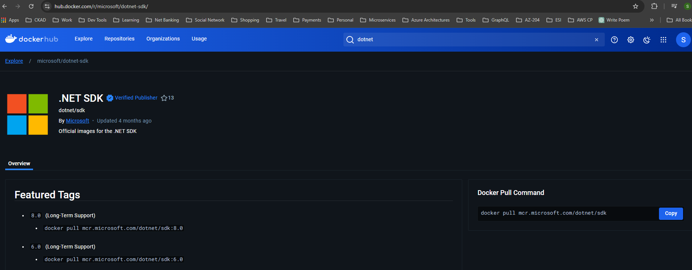
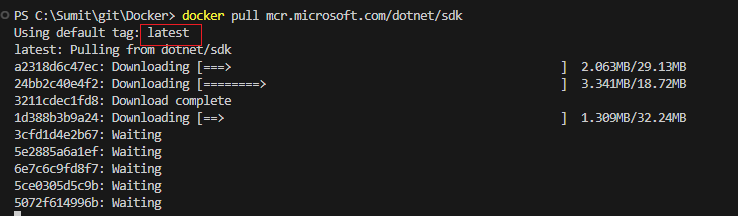

# Dot net Images

Go to docker hub and search for .net sdk https://hub.docker.com/r/microsoft/dotnet-sdk/

Run the command "docker pull mcr.microsoft.com/dotnet/sdk", here we are not providing the tag so it will take latest tag.

