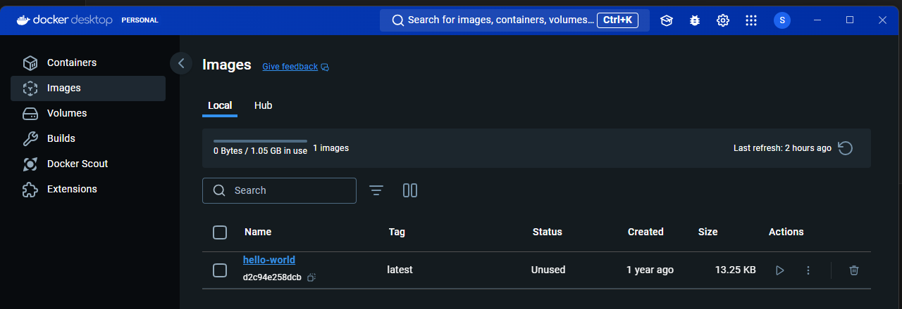
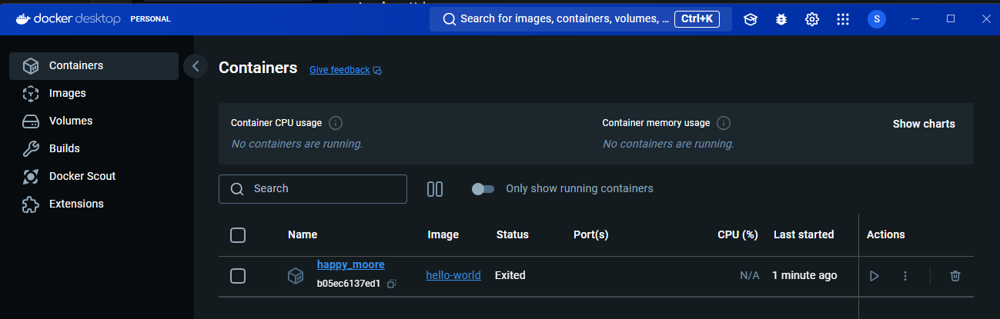

# How to run Hello World App from Docker Hub

1. go to >> https://hub.docker.com/
2. then click on Explore button
3. then Search for "Hello World"
4. Copy the command "docker pull hello-world" from the webpage.
5. Run command "docker --version" to check the version of the docker.
6. Run Command "docker images" or "docker images -a" to check if there are any images available in the docker desktop
7. Run the command "docker pull hello-world" from the webpage, then check "docker images" if the image is downloaded.

## How to run Docker Images

* Now we want to run this image in a container.
* Run command "docker run hello-world", the new container will start running.
* A new container is running with auto assigned name.

* run command "docker ps -a" this will show all the containers running in docker 

## How to Delete images from docker desktop

* run command "docker images"
* run command "docker rmi [image ID]" this will delete the image 

NOTE: if you want to delete the image then first you have to delete the container

## How to delete containers from the docker desktop

* run command "docker ps -a" to check the list of containers.
* run this command to delete the container "docker rm [container ID]"
* This is another option to delete "docker rmi {imagename}:{tagname}" >> "docker rmi ubuntu:latest"

## How to run a container for 10 seconds

* docker run -d ubuntu sleep 10

## How to "docker run without images"
Run the command "docker run {Imagename}:{tag}" >> "docker run hello-world"
this will download if the image no present in local and run it.

