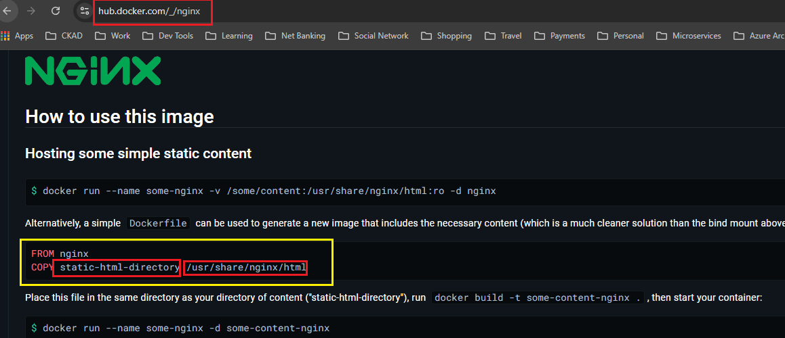

# First Docker file

1. create a html page "index.html" inside "SampleWebApp" folder and add some html there.
2. Now add a "dockerfile" just outside the "SampleWebApp" folder and add nginx image and copy your files.


If you see official documentation you will find the details.

https://hub.docker.com/_/nginx





# Building the docker image.

* cd to the folder where docker file is kept
* then run command "docker build -t SampleWebApp ." where -t is the tag you want to add to the image.
* the last "." tells the path of the dockerfile currently its in the same directory.
* repository name should be in lower case
* you can provide the image tag in the command "docker build -t SampleWebApp:1.0.0 .", but if you do not provide it will take latest as tag


# Running the docker image.

Run this command to run the image.
> docker run --name sample-web-app-container -p 9000:80 sample-web-app:latest


### Explaination of the above command

Here's the breakdown:

```bash
docker run --name sample-web-app-container -p 9000:80 sample-web-app:latest
```

### Explanation:

1. **`docker run`**: This is the command to create and start a new Docker container.

2. **`--name sample-web-app-container`**: This option assigns a name (`sample-web-app-container`) to the container. If you don’t provide a name, Docker will generate a random one.

3. **`-p 9000:80`**: This option maps a port on your host system to a port on the container. The format is `host_port:container_port`, meaning traffic sent to port `9000` on your local machine will be forwarded to port `80` inside the container (where web servers like Nginx or Apache often listen by default).

4. **`sample-web-app:latest`**: This specifies the image to use for the container. `sample-web-app` is the name of the Docker image, and `:latest` is the tag, indicating the latest version of the image.

### In summary:
This command runs a container from the `sample-web-app` Docker image, names the container `sample-web-app-container`, and makes the application inside the container accessible via `localhost:9000` on your host machine. Inside the container, the app is likely listening on port `80`.


## How to run docker image without occupying an powershell window (detached)

run this command

```bash
docker run --name sample-web-app-container -d -p 9000:80 sample-web-app:1.0.2
```

-d will detach the command from powershell window and run the command in the background


## How to retag the images

Run this command to change the tag for an image

```bash
docker tag samplewebapp:1.0.2 samplewebapp:latest
```

## Docker container start stop kill

> Docker kill {container id} {container id} {container id}

> Docker stop {container id} {container id} {container id}

> Docker start {container id}

> Docker restart {container id}


# Cleanup

get all the containers 

> $(docker ps -a -q)

remove all the containers

> docker rm $(docker ps -a -q)


Get All the docker images 

> docker images -q

remove all the docker images 

> docker rmi $(docker images -q)

if you get the tagging errors you can force them to delete

> docker rmi $(docker images -q) --force

